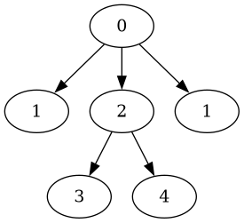
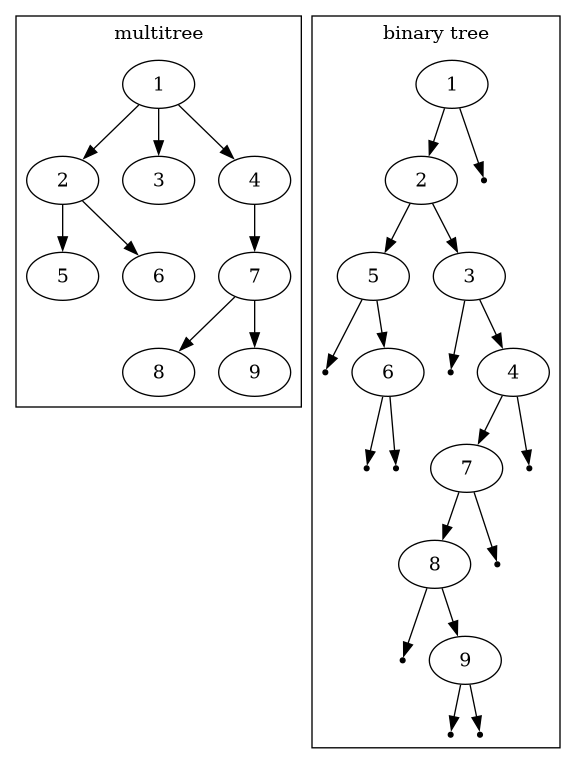

# Trees of a Higher Degree

Coding problems and other puzzles relating to "more than binary" trees.

One good paper on the topic:

[Representing Trees of Higher Degree](https://www.researchgate.net/publication/226863715_Representing_Trees_of_Higher_Degree),<br/>
D. Benoit, E. D. Demaine, J. I. Munro, R. Raman,<br/>
V. Raman, and S. S. Rao.<br/>
Algorithms and Data Structures,<br/>
6th International Workshop, WADS '99, Vancouver, British Columbia, Canada, August 11-14, 1999, Proceedings</br>

Benoit et al deal with "ordinal trees" and "cardinal trees".
Ordinal trees have nodes with arbitrary numbers of child nodes, kept in order.
None of the child nodes are unset/nil/null.
Leaf nodes have zero child nodes.

Cardinal trees have nodes that all have the same number of child nodes,
and keep them in order,
but one or more of the child nodes can be nil/null/unset.

And then there are the coding problems trees.

### Daily Coding Problem: Problem #237


A tree is symmetric if its data and shape remain unchanged when it is
reflected about the root node. The following tree is an example:

```
        4
      / | \
    3   5   3
  /           \
 9             9
```

Given a k-ary tree, determine whether it is symmetric.

---

I take "k-ary" to mean that each node can have an arbitrary
number of child nodes.
I also decided the child nodes have an order,
and that some of them might be nil (unset).
This is kind of an ordinal tree,
in that nodes don't necessarily have the same number of children,
but also like a cardinal tree, in that some child nodes can be unset.

#### package multitree

I wrote a small Golang package to represent trees where nodes
have any number of children, and some children can be unset.

Package multitree represents integer-valued nodes that form a tree,
each node having an arbitrary number of child nodes

```go
type Node struct {
	Data     int
	Children []*Node
}
```

`package multitree` has a function to parse a text representation
of a "k-ary" tree, yielding a full-blown Golang in-memory structure.

The text representation is a "balanced parentheses", lisp-like representation.
The example tree from the problem statement above can be represented as
`(4 (3 (9)) (5) (3 (9)))` or `(4 (3 (9) ()) (5) (3 () (9)))`

#### Algorithms

First, two nodes are partially identical if they are both non-nil,
have numerically equal data values,
and have the same number of child nodes.
Full equality amounts to partial equality,
and corresponding child nodes being fully equal.

I wrote two algorithms to do this.

#### Recursive

[Recursive program](sym.go)

I wrote a depth-first traverse of the tree that compares what should be identical
identical nodes:

```go
func symmetric(node1, node2 *multitree.Node) bool {
    // check for partial equality, return false if not
    for i := 0; i < len(node1.children); i++ {
        mirror := childCount - idx - 1
        if mirror < i { break }
        if !symmetric(node1.children[i], node2.children[mirror]) {
            return false
        }
    }
    return true
}
```

The line `if mirror < i { break }` is important.
In a lot of similar coding, 
like checking for "palindrome" symmetry,
you'd see `if mirror <= i ...`.
The code doesn't need to check the exact middle value in those cases.
Besides if `i == mirror`, `func symmetry` gets called with the same
node as both arguments.
Why bother?

If the code doesn't check an exact middle node against itself,
it misses finding unsymmetrical trees like this:



I had to include both nodes non-nil as one of the partial equality criteria
because I allowed unset child nodes in the string representation parsing.
Benoit et al's ordinal trees wouldn't have that criteria.

The function only has to check half the child nodes against the other half.

#### Iterative

[Iterative program](sim_iterative.go)

My iterative algorithm does a depth-first search with an explicit FIFO stack.
I implemented the stack with a linked list:

```go
ype NodePair struct {
    node1 *multitree.Node
    node2 *multitree.Node

    next *NodePair
}

type NodePairStack struct {
    top *NodePair
}
```

Usually I prefer to keep track of a tree as the bare root node,
and a stack a a pointer to a stack element,
but because I needed to keep track of a pair of multitree `Node` elements,
I used a special purpose container (`type NodePair`)
and an explicit "stack" struct that had a pointer to the top (first in)
`*NodePair`.
I wrote the standard "stack" methods for `type NodePairStack`,
`Push()`, `Pop()` and `Empty()`.

The iterative algorithm 
begins by pushing `root` and `root` on the stack,
then loops over a non-empty stack.
Each iteration
pops the stack, checking the two resulting `*Node` structs
for partial equality.
It pushes pairs of child nodes (as in the recursive algorithm above)
that _should be fully equal_ on the stack.
Because of the mirror symmetry of the child nodes,
I'm not sure you can say "in order", "pre-order" or any of the other
names for binary tree traverses.

The example k-ary tree,

```
        4
      / | \
    3   5   3
  /           \
 9             9
```

would push child nodes left-3 and right-3 nodes as a pair on the explicit stack,
and I think the 5-valued-node duplicated as a pair.
if the 5-valued node had child nodes, they would need to be checked, too.
The pair of 3-valued nodes get popped off the explicit stack,
the two 9-valued nodes get pushed, etc etc.

### Analysis

A web search turns up a lot of "are binary trees symmetric" solutions,
but very few multi-child tree solutions.


Beyond needing to check "middle" child nodes against themselves,
there are a few tricky parts.
The first is that instead of a recursive comparison having to
"go left" for one child, and "go right" for the other child,
the code has to compare "mirror" nodes.
For a node with 4 children, that's comparing child 1 and child 4,

If you assume that unset child nodes are significant,
you end up having to deal with cases like this:

```
tree 1: (4 (3 () (6)) (5) (3 (6) ()))
tree 2: (4 (3 (5) ()) (5) (3 (5)   ))
```

My software says neither tree is symmetric.
Is tree 2 symmetric? 
The two 3-valued nodes have different length child-node-arrays.
The left-hand 3-valued node has a nil-valued node as its third child.

I believe this is why Benoit et al make a distinction between "ordinal trees",
with no unset/nil/null child nodes,
and "cardinal trees" with a fixed number of child nodes.

### Interview Analysis

Despite potential confusion about allowing nil/null/unset child nodes,
this is a decent interview problem.
Multi-child trees don't occur too often in day-to-day programming,
so candidates probably haven't worked with them before.
I know I had to build some infrastructure
(new Node type, input and output functions)
to do this problem.
My binary tree infrastructure was not suitable.

The interviewer would get to see if a candidate could ask good questions
since ordering of child nodes is potentially a sticky issue.
The interviewer could see if a candidate can do array indexing
and recursive problem solving.

When careless mirror child node selection can lead to examining the tree twice,
and the idea that both comparison nodes can refer to the same node exist,
the interviewer might get to see if the candidate can demonstrate a little insight.

A [non-recursive solution](sym_iterative.go) might be given extra points.
It's basically the same as a depth-first traverse of a binary tree,
except that the code has to keep track of two nodes in the tree to compare.
An iterative solution would require more "infrastructure" code,
a stack or queue to keep track of pairs of nodes-to-compare,
but none of this is very special code.

Overall, a decent problem for an interview, I think.

## Knuth Transform

From Wikipedia's [Left-child right-sibling binary tree](https://en.wikipedia.org/wiki/Left-child_right-sibling_binary_tree):

```
The process of converting from a k-ary tree to an LC-RS binary tree is
sometimes called the Knuth transform. To form a binary tree from an
arbitrary k-ary tree by this method, the root of the original tree is made the
root of the binary tree. Then, starting with the root, each node's leftmost
child in the original tree is made its left child in the binary tree, and its
nearest sibling to the right in the original tree is made its right child in
the binary tree.
```

[Another explanation](https://xlinux.nist.gov/dads/HTML/binaryTreeRepofTree.html).

I wrote [code to do that transform](transform.go), just for fun.
This is the example tree shown in the Wikipedia article:

```
$ ./transform '(1 (2 (5) (6)) (3) (4 (7 (8)(9))))' > x.dot
$ dot -Tpng -o x.png x.dot
```

That will get you a PNG graphic showing a multitree and the equivalent binary
tree after a Knuth Transform.



The reverse is just as easy: the special format binary trees produced by a Knuth Transform
can be returned to a k-ary tree.

```
$ ./transform -r '(1 (2 (5 () (6)) (3 () (4 (7 (8 () (9)))))))' > x.dot
$ dot -Tpng -o x.png
```


---

### Daily Coding Problem: Problem #686 [Hard]

This problem was asked by Adobe.

You are given a tree with an even number of nodes.
Consider each connection between a parent and child node to be an "edge".
You would like to remove some of these edges,
such that the disconnected subtrees that remain
each have an even number of nodes.

For example, suppose your input was the following tree:

```
   1
  / \ 
 2   3
    / \ 
   4   5
 / | \
6  7  8
```

In this case, removing the edge (3, 4) satisfies our requirement.

Write a function that returns the maximum number of edges you can remove
while still satisfying this requirement.

### Analysis

I haven't worked on this yet.
